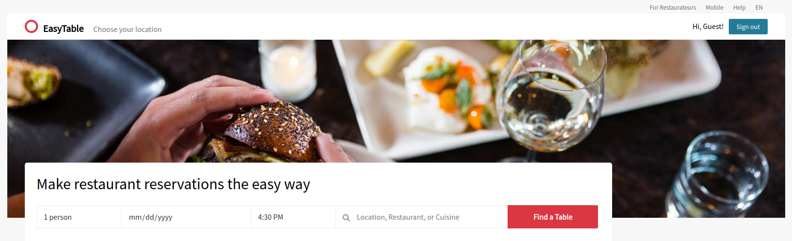
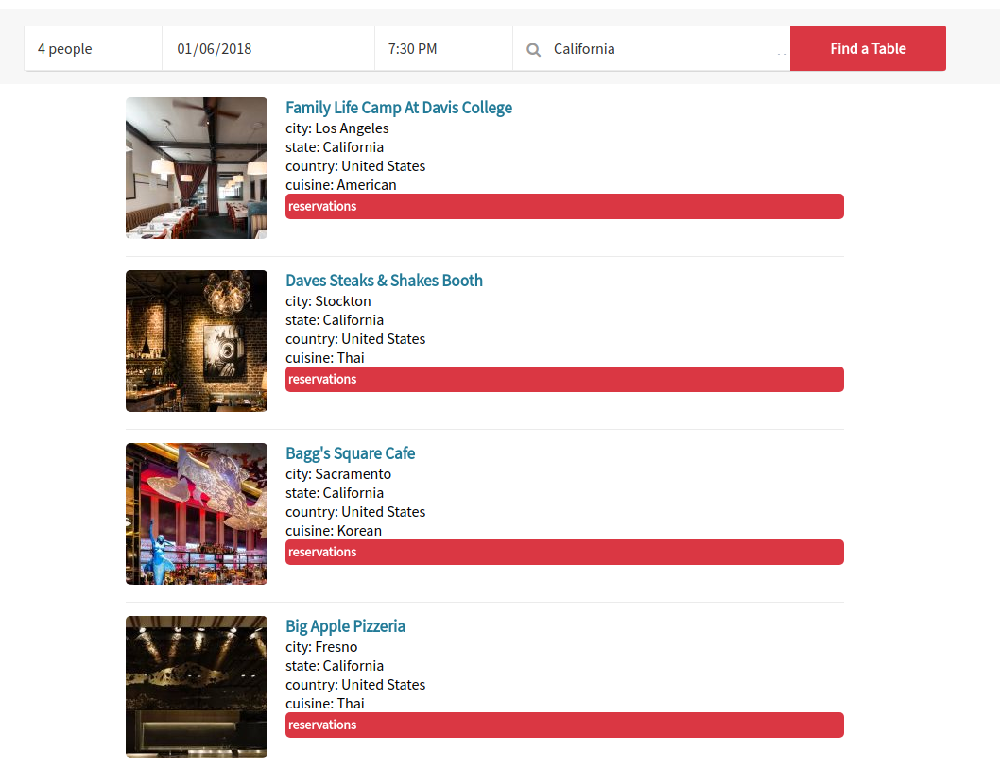
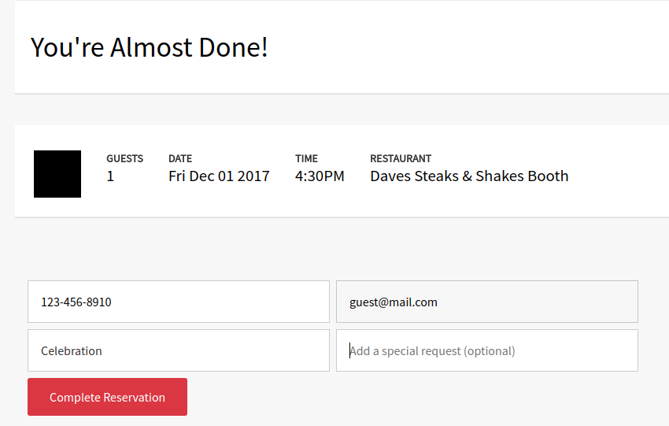
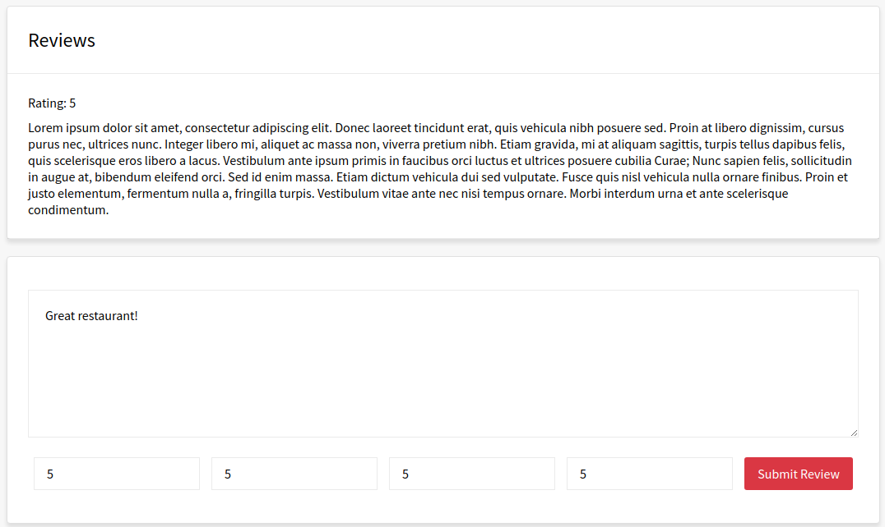

# EasyTable

[Easytable Live](https://easytable.herokuapp.com/)

 EasyTable is a full-stack web application inspired by OpenTable. The backend
 is built on Ruby on Rails with a PostgreSQL database and the frontend consists
 of a React/Redux architecture.

## Features

### Search

EasyTable makes it easy for users to search restaurants to find available
reservations. One can search by location, restaurant name, or type of food.

### Reservations

When users come across a restaurant they like, EasyTable allows the user to
select the time, date, and party size for their reservation. Booking a
reservation is as simple as a few clicks.

### Reviews

EasyTable users once logged in can write reviews of restaurants they've eaten at.

## Upcoming Changes
* Styling enhancements
* Shortcut buttons for reservations in restaurant index
* User favorites page
* Improved restaurant review form
